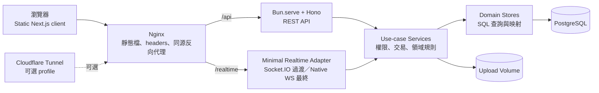
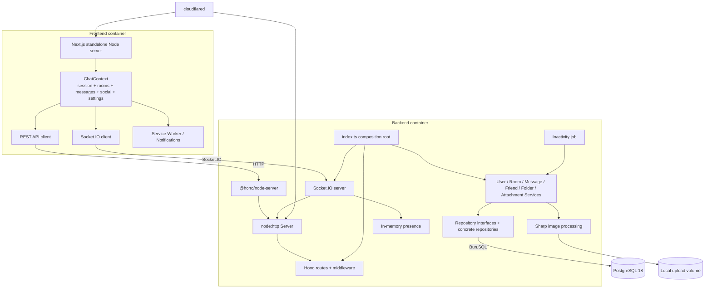
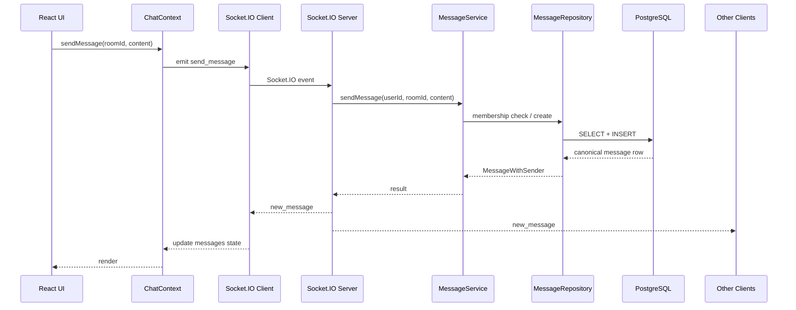
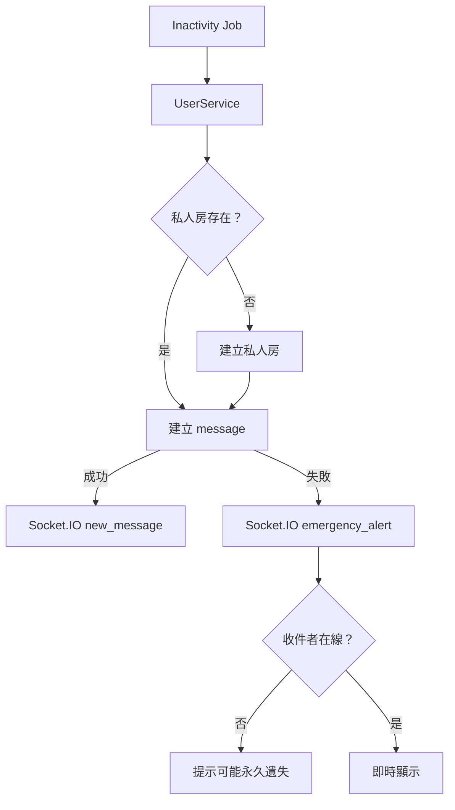
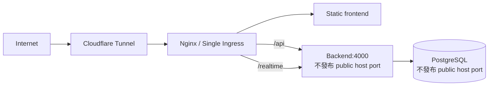
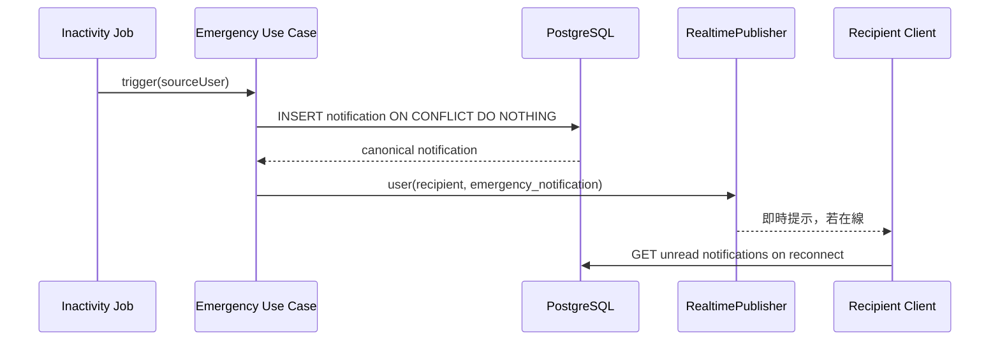
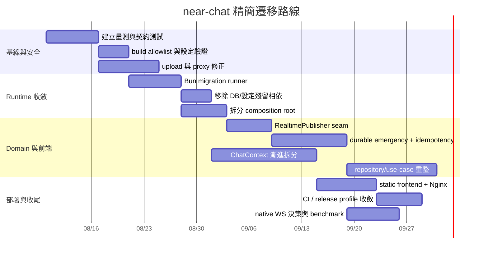
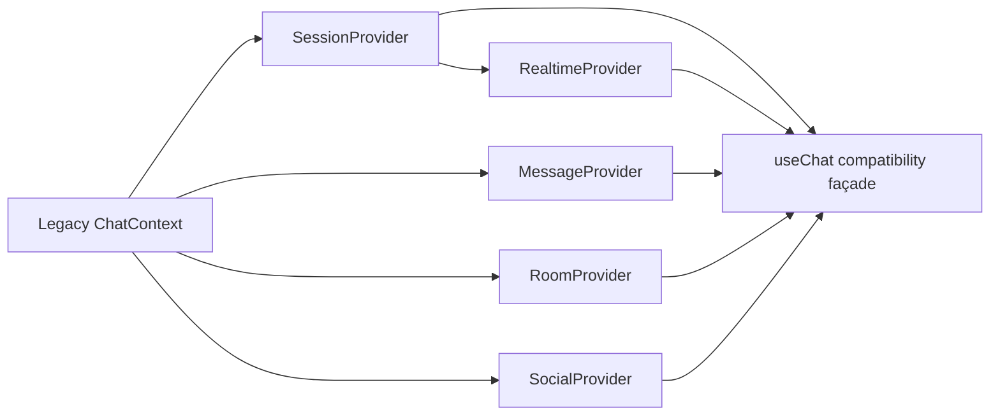

# near-chat 可精簡性深度研究報告

## 執行摘要

本報告將使用者所稱的「near-chat」辨識為公開 GitHub 專案 `nearcsie/near-chat`，並以截至 **2026 年 8 月 4 日**可取得的 `main` 分支為分析基準。專案目前版本為 **2.1.0**；最近兩個主要版本分別在 2026 年 7 月 29 日完成 Node.js／Express 至 Bun／Hono 的破壞性遷移，以及在 2026 年 7 月 31 日加入群組邀請功能。這表示專案剛完成一次大型架構重構，仍存在文件、相依套件、容器、測試與未完成 issue 之間的過渡痕跡。fileciteturn43file0L2-L2

**結論是：near-chat 可以明顯精簡，但不應以一次性全面重寫完成。** 最值得優先執行的精簡工作不是大型原生 WebSocket 重構，而是移除殘留的雙執行環境、縮小組裝根與前端全域狀態、清除不必要相依、修正部署拓撲，以及把既有抽象縮減到真正需要替換或測試的邊界。

目前最明顯的結構性問題包括：

| 判斷 | 主要證據 | 建議 |
|---|---|---|
| 後端名義上是 Bun，實際工具鏈仍同時需要 Node、pnpm 與 Bun | 應用資料庫層已使用 `Bun.SQL`，但 migration 仍依賴 `node-pg-migrate` 與 `pg`；production builder 必須從 Node 映像複製工具鏈 | 先導入最小 Bun migration runner，移除 `node-pg-migrate`、`pg`、`@types/pg` |
| HTTP 層仍為 Hono → Node request listener → `node:http` → Socket.IO | `index.ts` 使用 `@hono/node-server` 與 `createServer`，並在同一 server 掛載 Socket.IO | 先抽出 typed realtime publisher；確認需求後才決定是否改為 `Bun.serve` 原生 WebSocket |
| `index.ts` 是過大的 composition root | repository、service、route、Socket.IO、排程、上傳目錄、事件轉送及版本讀取集中在單檔 | 拆成 `createRepositories`、`createServices`、`createHttpApp`、`createRealtime`、`startServer` |
| repository interface 呈現一對一包裝傾向 | 例如 `IRoomRepository` 只有單一實作，service 建構子同時接受大量 repository 與 callback | 保留 transaction／外部服務邊界；一般 CRUD 改用結構型別或領域 store |
| 前端 `ChatContext` 職責過多 | 同一 context 匯入幾乎全部 REST API、Socket.IO 操作、路由、通知、房間、訊息、好友、封鎖、設定及緊急聯絡人 | 拆成 session、room、message、social、preferences 五個 domain stores/hooks |
| production 前端仍需要完整 Node runtime | `next.config.ts` 為 `output: "standalone"`；production runner 是 `node:24-slim` | 若路由不依賴動態 server 功能，改為 static export，由 Nginx 處理 headers 與 fallback |
| package build script 權限過寬 | 根 workspace 使用 `dangerouslyAllowAllBuilds: true`，而原 issue 只要求允許 `sharp` | 改回明確 allowlist，例如只允許 `sharp` |
| release pipeline 相對專案規模偏重 | CI、GitHub App、Release Please、tag ruleset、四個 image references、attestation 與 bundle recovery 相互耦合 | 若供應鏈保證不是核心產品需求，縮為 CI → Release PR → 兩映像＋Compose bundle |
| issue tracker 中規劃的原生 WebSocket 方案明顯超出目前產品複雜度 | 規格包含 ticket、lease、renewal、ACK/NACK、idempotency、delta cursor、backpressure、跨節點 adapter、WebTransport 延伸等 | 不直接實作完整規格；先處理 durable emergency、message idempotency 與 reconnect catch-up |

專案已經成功移除了大量 Express 生態依賴，並將原先 14 個後端子目錄扁平化為 6 個核心目錄，因此不能把現況視為完全失控；真正問題是**上一輪重構尚未完全收尾，而下一輪更大型的 realtime 重構已開始被設計**。fileciteturn46file0L3-L6

建議的目標不是追求最少檔案，而是形成以下較小且可驗證的系統：



在一位熟悉 TypeScript、Bun、Next.js 與 PostgreSQL 的全端工程師假設下，**低風險收斂可在約 4–6 週完成；包括前端狀態拆分與 realtime transport 漸進式替換的完整路線約需 10–14 週**。完整實作 issue #490 所描述的可靠、可恢復、可跨節點原生 WebSocket 協定，則更接近獨立子專案，合理量級約為額外 6–12 週，而不是一般相依套件替換。

## 研究範圍與現況基線

### 專案定位與版本

near-chat 是一個即時群組聊天應用，功能範圍包括私人與群組聊天室、權限控制、房間資料夾、訊息生命週期、附件、好友／封鎖關係，以及緊急聯絡與警示。README 將目前技術棧描述為 Next.js 16、React 19、Tailwind CSS 4、Socket.IO client、Bun、Hono、Socket.IO、PostgreSQL 18、Docker Compose 與 pnpm workspace。fileciteturn3file0L2-L2

根目錄、前端與後端皆使用同一版本號；root package 指定 pnpm 11.15.0 與 Node.js 24 以上，而後端又以 Bun 執行應用與測試，形成「pnpm 管工作區、Node 跑 pnpm／部分 CLI、Bun 跑應用」的三工具鏈。fileciteturn5file0L2-L2

後端直接相依包括 Hono、Hono Node adapter、Zod validator、Socket.IO、Bun 可用但 Node-based 的 migration 工具、`pg`、`sharp`、`config`、`dotenv` 與 `dotenv-expand` 等；前端則依賴 Next.js、React、Socket.IO client、Iconify、`clsx` 與 `tailwind-merge`，並啟用 React Compiler、Vitest、jsdom 與 Testing Library。fileciteturn7file0L2-L2 fileciteturn8file0L2-L2

### 現有模組

後端採 routes → services → models/repositories 三層主結構，另有 middleware、realtime、utils。專案文件明確要求 routes 負責 Hono routing 與 Zod 驗證，services 負責業務與權限，models 負責 raw SQL，repository interfaces 則供 service mock 測試使用。fileciteturn13file0L2-L2

依目前 source tree 與組裝程式，可辨識以下主要領域：

| 領域 | 路由／入口 | Service | Repository／資源 |
|---|---|---|---|
| 驗證與使用者 | auth、users routes | `userService` | user、refresh token、emergency contact repositories |
| 房間與成員 | room routes | `roomService` | room、room member、message、user、friend repositories |
| 訊息 | room message routes、Socket.IO events | `messageService` | message、room、room member repositories |
| 好友與封鎖 | friend、friend-request、block routes | `friendService` | friend repository、room service callbacks |
| 資料夾 | folder routes | `folderService` | folder、room member repositories |
| 附件與頭像 | attachment routes、avatar endpoints | `attachmentService`、upload utilities | attachment repository、local upload volume、Sharp |
| 即時狀態 | Socket.IO connection handlers | service methods與直接 repository 呼叫 | in-memory presence、Socket.IO rooms |
| 排程 | inactivity job | user service callback | user repository、emergency alert flow |

`index.ts` 同時建立所有 repositories、services、Hono routes、Node HTTP server、Socket.IO server、CORS、rate limit、靜態上傳路由、inactivity job 與各種事件轉送 callback。這使它不只是 composition root，而同時承擔 runtime adapter 與業務流程協調。fileciteturn20file0L2-L2

### 建置與部署

開發環境以 Docker Compose 同時啟動 PostgreSQL、backend 與 frontend；原始碼使用 bind mounts，而 package-level `node_modules` 與 `.next` 使用匿名 volume。這種做法提供一致容器環境，但也造成 stale anonymous volume、工作目錄變更後舊附件路徑失效，以及需要額外 `--renew-anon-volumes` 排障的開發摩擦。fileciteturn25file0L2-L2 fileciteturn11file0L2-L2

production Compose 包含 PostgreSQL、backend、frontend 與 cloudflared tunnel。PostgreSQL 與 backend/frontend ports 仍發布到 host，cloudflared 只是額外入口，而不是唯一 ingress。fileciteturn26file0L2-L2

後端 production image 的 builder 以 Bun 為 base，卻從 `node:24-slim` 複製 `/usr/local`，再用 Corepack 安裝 pnpm；runner 本身是 Bun-only，但啟動時仍會執行 migration script。fileciteturn27file0L2-L2

前端採 Next.js standalone output，builder 與 runner 都依賴 Node 24，並將 `.next/standalone`、static assets 與 public files 複製到 production image。fileciteturn23file0L2-L2 fileciteturn28file0L2-L2

### Release 與 CI

CI 使用一個 path-detection job 判斷是否執行 frontend、backend、database 與 security reusable workflows，再由 `required-checks` 聚合結果。這個設計可避免文件變更執行昂貴工作，但 workflow filename、display name、job name 與 release workflow 間存在明確的 load-bearing coupling。fileciteturn35file0L2-L2

Release 流程使用 Release Please PR、專用 GitHub App token、tag ruleset、精確 commit CI 驗證、frontend/backend images、commit 與 version references、provenance attestations、PostgreSQL digest及 Compose bundle。文件也包含半完成 publication 的 fail-closed recovery 邏輯。對需要供應鏈稽核的正式產品而言這是合理設計，但對課程型或單節點自架聊天系統而言，維護成本偏高。fileciteturn30file0L2-L2

## 架構與資料流分析

### 現有元件互動



目前 `shared/types.ts` 提供 REST entity types 與 Socket.IO event maps，但共享的是 TypeScript compile-time interface，而不是 wire payload 的 runtime schema；`room_update.data` 甚至使用 `any`。因此前後端有一定型別共享，卻沒有完整 runtime contract。fileciteturn44file0L2-L2

前端的 `ChatContext.tsx` 是明顯的 god context：它在同一模組匯入大量使用者、聊天室、附件、好友、封鎖、資料夾、設定、緊急聯絡人 API，以及完整 Socket.IO command/event helper，並因多個刻意省略 dependency 的 effects 而對整個檔案停用 React Compiler 規則。fileciteturn24file0L2-L2

後端則存在對稱問題：`roomService` 同時接受 room、room member、social、user、message repository，兩個 event-emitter callbacks 與 avatar store。它涵蓋建立房間、私人房、成員管理、邀請、權限、系統訊息、房間 avatar 與 realtime notification；單一 service 已逐步演化成多 use-case façade。fileciteturn22file0L2-L2

### 典型訊息資料流



目前共享 event map 的 `send_message` 不含 `clientMessageId` 或 ACK callback，代表 transport 層沒有顯式冪等 key；若 client 在不確定 server 是否已提交的情況下重送，就需要額外應用邏輯避免重複。這正是原生 WebSocket 規格 issue 希望藉 command ID、ACK/NACK 與 operation-specific idempotency 解決的問題。fileciteturn44file0L2-L2 fileciteturn37file0L3-L6

### 緊急警示資料流

`index.ts` 中的 emergency callback 會嘗試找到或建立私人房間，再建立 durable message；如果建立或發送失敗，則退回只向使用者 Socket.IO room 發送 `emergency_alert`。離線收件人無法收到這個瞬時 fallback，因此目前語意可能是「排程已嘗試通知」，而不是「通知已持久化」。fileciteturn20file0L2-L2



### 現況與建議目標比較

| 面向 | 現有架構 | 建議精簡架構 | 主要收益 | 代價 |
|---|---|---|---|---|
| 前端 runtime | Next.js standalone Node server | Next.js static export＋Nginx | 移除 frontend Node runtime、縮小 attack surface 與 idle RSS | `headers()`、redirect/rewrite 等需移至 Nginx |
| 前端狀態 | 單一大型 `ChatContext` | domain hooks/stores＋薄 facade | 減少重渲染範圍、測試與 ownership 更清楚 | 需分階段維持相容 context |
| HTTP server | Hono adapter＋`node:http` | `Bun.serve({ fetch: hono.fetch })` | 移除 Node HTTP adapter 與 `@hono/node-server` | 必須先處理 Socket.IO transport |
| Realtime | Socket.IO 與 services/callbacks 直接耦合 | `RealtimePublisher` port＋單一 adapter | 可先保持 Socket.IO，日後平滑換 transport | 初期多一層很薄的 adapter |
| Realtime reliability | 無一致 command ID／ACK／catch-up | 最小 idempotency＋REST delta catch-up | 解決真正的重送與重連問題 | 需要 DB constraint/schema migration |
| Repository | 每領域 interface＋單實作 class | domain store／結構型別，僅外部邊界保留 port | 減少 interface/class/constructor boilerplate | mock 寫法需調整 |
| Service | 大型領域 façade | transaction-oriented use cases | 權限與 transaction 邊界更清楚 | 檔案數可能增加，但單檔複雜度下降 |
| DB tooling | Bun.SQL app＋Node migration CLI＋`pg` | Bun.SQL app＋Bun migration runner | 移除重複 driver 與 Node-only migration | 需精確相容 `pgmigrations` |
| Upload | `parseBody()` 後才做權威 size check | ingress／stream 層 byte limit | 防止超量 body 完整緩衝 | multipart streaming 實作較複雜 |
| Proxy | frontend、backend ports＋cloudflared 並存 | 單一 Nginx ingress，backend 不對外發布 | CORS、可信 proxy、rate limit 語意簡單 | 本機與 production URL 需遷移 |
| Build scripts | 允許所有 dependency build scripts | 只允許已核准的 native deps | 降低供應鏈風險 | 新增 native dep 時需顯式審查 |
| Releases | 多 workflow、App、attestation、bundle recovery | 保留 Release Please，縮減 publication graph | 降低 CI 維護與 secret/ruleset coupling | 供應鏈證明能力降低 |

Next.js 官方文件確認 `output: "export"` 會產生不需要 Node runtime 的 HTML/CSS/JS，並可由 Nginx 提供；但 cookies、dynamic request handlers、rewrites、redirects、headers、ISR、預設 image optimization 與 Server Actions 等 server-dependent 功能不受支援。near-chat 現有 `next.config.ts` 為 service worker 設定自訂 headers，因此 static export 並非單改一行即可，這些 headers 必須移至 Nginx。citeturn4search0 fileciteturn23file0L2-L2

值得注意的是，issue #293 已將「static export＋Nginx」標記完成，並宣稱 frontend RSS 可由約 150 MB 降至約 5 MB；然而目前 `main` 仍為 standalone Node runner。故該數字應視為 issue 的目標／歷史估計，不是目前版本的已驗證結果。fileciteturn45file0L3-L7 fileciteturn28file0L2-L2

## 可移除、可合併與過度設計點

### 雙資料庫與雙 runtime 工具鏈

這是風險最低、證據最明確的精簡項目。`backend/src/models/db.ts` 已直接建立 `new SQL(...)`，應用資料存取不再使用 `pg`。fileciteturn19file0L2-L2

但 backend package 仍保留 `node-pg-migrate`、`pg` 與 `@types/pg`，migration commands 也仍呼叫 Node CLI。專案 issue #421 已確認現有 16 個 migration 都是純 SQL，且 `pg` 只因 migration 工具鏈而存在。fileciteturn36file0L3-L7

Bun 官方 SQL client 支援 PostgreSQL、connection pooling、transactions、執行多 statement simple query，以及直接執行 SQL file；官方文件也明確指出 multi-statement simple queries 適合 migration/setup scripts。citeturn5view0

因此可移除：

```text
node-pg-migrate
pg
@types/pg
```

後端 production runner 本來已不複製 Node；真正可縮短的是 builder 與安裝圖。不過只移除 migration CLI 還不足以完全移除 builder 中的 Node，因為現行 pnpm 11 本身仍需要 Node，Dockerfile 也明確記錄 Bun 尚未提供 pnpm 所需的 `node:sqlite`。fileciteturn27file0L2-L2

**合理目標是先移除 Node runtime dependency，不要同時強迫 workspace 從 pnpm 遷移至 Bun package manager。** 後者會牽涉 lockfile、workspace deploy、CI caches 與 frontend build，應獨立評估。

### 過寬的 dependency build 權限

根 `pnpm-workspace.yaml` 使用 `dangerouslyAllowAllBuilds: true`，代表 dependency installation 可執行所有 package lifecycle build scripts。fileciteturn6file0L2-L2

原始 sharp 問題的修正建議只是把 `sharp` 加入 `onlyBuiltDependencies`；目前設定從「允許一個已審核 native dependency」擴張成「允許所有 dependency scripts」，超出需求。fileciteturn42file0L3-L7

建議立即改成 allowlist：

```diff
 packages:
   - frontend
   - backend

-dangerouslyAllowAllBuilds: true
+onlyBuiltDependencies:
+  - sharp
```

這幾乎沒有 migration 成本，卻能避免未來新增或遭供應鏈污染的 dependency 在 install 階段自動執行任意 build script。

### 可能未使用的設定依賴

backend package 宣告 `config`、`dotenv` 與 `dotenv-expand`，但目前可搜尋的後端 source 未發現對這些套件的引用；現有程式大量直接讀取 `process.env`，而 Bun 本身會載入環境變數。fileciteturn7file0L2-L2 fileciteturn48file0L2-L4

這三個 dependency 應列為**移除候選**，但 merge 前必須使用 `knip`、`depcheck` 或 TypeScript import graph 再確認 scripts、config bootstrap 與測試 fixture 沒有動態載入。建議不要以純文字搜尋作為唯一刪除依據。

理想狀態是由單一 typed config module 在 process 啟動時解析：

```ts
// backend/src/config/env.ts
import { z } from "zod";

const EnvSchema = z.object({
  NODE_ENV: z.enum(["development", "test", "production"]).default("development"),
  PORT: z.coerce.number().int().positive().default(4000),
  DATABASE_URL: z.string().url(),
  JWT_SECRET: z.string().min(32),
  CORS_ORIGINS: z.string().default("http://localhost:3000"),
  TRUST_PROXY: z.enum(["true", "false"]).default("false"),
  ATTACHMENT_MAX_BYTES: z.coerce.number().int().positive().default(10 * 1024 * 1024),
});

export const env = EnvSchema.parse(Bun.env);
```

這能把目前分散於 middleware、DB initialization、Compose default 與 route utilities 的隱性型別轉換集中起來，也可避免 `"false"` 被一般 JavaScript truthiness 誤判為 true。

### Repository interface 的一對一樣板

`IRoomRepository` 主要是七個 CRUD/query methods 的 interface，而 production 只有一個 `RoomRepository` 實作。fileciteturn21file0L2-L2

interface 並非本身有害；問題是當每個 concrete repository 都配一個完全同形 interface，只為 unit test mock 而存在時，會造成：

- 每次 query 增減需同步修改 interface、class、factory、mock。
- service constructor 參數持續膨脹。
- transaction 無法自然跨 repository，反而容易把原子操作拆成多次獨立 query。
- 測試傾向 mock 實作細節，而不是驗證 use-case outcome。

建議採兩級邊界：

```ts
export type RoomStore = Pick<
  RoomRepository,
  "findById" | "findByMember" | "create" | "update"
>;

export type CreateRoomDeps = {
  rooms: RoomStore;
  members: Pick<RoomMemberRepository, "findMember" | "add">;
  tx: TransactionRunner;
  realtime: RealtimePublisher;
};
```

對真正可能替換的 boundary 保留明確 port，例如：

```ts
interface AvatarStore { save(...): Promise<StoredAvatar> }
interface RealtimePublisher { toRoom(...): void; toUser(...): void }
interface Clock { now(): Date }
interface TransactionRunner { run<T>(fn: (db: Db) => Promise<T>): Promise<T> }
```

這比為所有 SQL class 建立名義 interface 更能支持測試與替換。

### 過大的 composition root 與 callback wiring

`index.ts` 中 `userService` callback 會引用之後宣告的 `roomService`、`messageService` 與 `io`；`roomService` 再接收兩種 emit callback；`friendService` 又接收 room service methods。雖然閉包在實際呼叫時才取值，可正常執行，但依賴圖難以閱讀，也容易形成循環 use-case coupling。fileciteturn20file0L2-L2

建議將 event delivery 抽成物件，而不是多個 `(id, eventName, payload)` callbacks：

```ts
export interface RealtimePublisher {
  room<E extends RoomEventName>(
    roomId: string,
    event: E,
    payload: RoomEventPayload<E>,
  ): void;

  user<E extends UserEventName>(
    userId: string,
    event: E,
    payload: UserEventPayload<E>,
  ): void;
}
```

組裝根可拆成：

```text
src/bootstrap/
  createConfig.ts
  createRepositories.ts
  createServices.ts
  createHttpApp.ts
  createRealtime.ts
  startJobs.ts
  main.ts
```

這不會改變 domain 行為，也不要求立即移除 Socket.IO。

### 大型 RoomService

`roomService` 將房間設定、私人房生命週期、邀請、成員審批、角色管理、離開、刪除、頭像、系統訊息與 realtime event 全部包在同一 factory。fileciteturn22file0L2-L2

建議不以「每個 method 一個 class」的極端方式拆分，而按 transaction 與規則群組：

```text
roomQueries
  getRoom
  listRooms
  listMembers
  previewInvite

roomLifecycle
  createGroup
  createOrReopenPrivateRoom
  deleteGroup

roomMembership
  joinByInvite
  leave
  approve
  kick
  changeRole
  transferOwnership

roomProfile
  updateSettings
  updateAvatar
```

`joinByInvite`、`leave` 與 `approve` 都會同時修改 membership、建立 system message、發送 room event，應由明確 transaction 包住。現有程式多次依序 `await` 不同 repositories，若中途失敗，資料與事件可能不一致；精簡 repository 層時應同時改善 transaction boundary，而不是只刪 interface。

### 前端 God Context

`ChatContext` 同時維護：

```text
session/user
rooms/members
messages/read states/typing
friends/requests/blocks
folders
preferences/theme/language
emergency contacts
socket lifecycle
notifications
router redirects
API token refresh
```

其頂部註解明確表示，由於多個 effects 刻意關閉 `react-hooks/exhaustive-deps`，整個檔案停用 React Compiler 規則。fileciteturn24file0L2-L2

建議漸進拆分，不必立即引入 Redux、Zustand 或 React Query。先使用 React 內建 Context＋hooks 即可：

```text
SessionProvider
  user, token hydration, refresh, logout

RealtimeProvider
  socket connect/reconnect, event subscription

RoomProvider
  rooms, members, folders, activeRoomId

MessageProvider
  messages by room, optimistic sends, read positions, typing

SocialProvider
  friends, requests, blocks, emergency contacts

PreferencesProvider
  theme, language, notification settings
```

為避免大量 consumer 同時改寫，保留一個相容 façade：

```ts
export function useChat(): LegacyChatContext {
  const session = useSession();
  const rooms = useRooms();
  const messages = useMessages();
  const social = useSocial();
  return useMemo(
    () => ({ ...session, ...rooms, ...messages, ...social }),
    [session, rooms, messages, social],
  );
}
```

最主要收益是維護性、測試性與縮小重渲染 blast radius；除非再搭配 route-level lazy loading，不能預設它會直接大幅縮小 JavaScript bundle。

### Static frontend 的未完成遷移

現有前端大量資料操作在 client context 中透過外部 backend REST 與 Socket.IO 完成，這種 SPA 型態通常適合 static export。Next.js 官方也明確支援 client-side data fetching、browser APIs 與 SPA-like navigation 的 static export。citeturn4search0turn4search2

主要阻礙是：

1. `next.config.ts` 的 `headers()` 在 static export 不生效。
2. 必須確認所有 dynamic routes 可在 build time 生成，或改成 query/client routing。
3. 預設 Next image optimization 不可用。
4. 若有 cookies、Server Actions、request-dependent route handlers 或 proxy，必須遷移至 backend／Nginx。

near-chat 已將圖片壓縮移到 backend Sharp，因此缺少 runtime image optimizer 的影響較低；service worker headers 可直接在 Nginx 設定。fileciteturn45file0L3-L7

### Sharp 不宜直接移除，但應隔離

Sharp 帶來 native binary 安裝、optional dependency 與 sandbox 相容性問題。近期 issue 記錄一次測試執行有 419 項通過、5 項 `avatarUpload.test.ts` 因 Sharp 環境失敗；該 issue 後來以 duplicate 關閉。fileciteturn41file0L3-L7

然而如果採 static frontend，backend upload-time WebP conversion 正好取代 Next runtime image optimization，所以直接移除 Sharp可能增加儲存與流量。較好的精簡不是刪掉功能，而是隔離：

```ts
export interface ImageProcessor {
  avatar(input: Blob): Promise<ProcessedImage>;
  attachment(input: Blob): Promise<ProcessedImage>;
}

export const passthroughProcessor: ImageProcessor = {
  async avatar(input) {
    return { bytes: await input.arrayBuffer(), mime: input.type };
  },
  async attachment(input) {
    return { bytes: await input.arrayBuffer(), mime: input.type };
  },
};
```

production 使用 `SharpImageProcessor`，unit tests 使用 passthrough/fake；只有少量 integration tests 實際載入 native Sharp。如此可減少測試環境污染，而不犧牲圖片優化。

### 原生 WebSocket 規格的過度設計風險

issue #490 的問題定義是合理的：現有 Socket.IO vocabulary、connection lifecycle 與 services 耦合，且缺少明確 ACK、冪等重送、重連修復與 bounded backpressure。fileciteturn37file0L3-L6

但其完整 solution 同時引入：

- 短效 WebSocket tickets
- subprotocol negotiation
- session lease 與 `auth.renew`
- 每個 tab 獨立 connection
- command ID、ACK/NACK 與 retry taxonomy
- message revision 與 delta cursor
- high-water synchronization window
- membership horizon 與 cursor binding
- typing TTL、presence grace
- connection、account 與 frame budgets
- backpressure queues
- graceful drain
- correlation／trace IDs
- Redis 與 WebTransport adapter 邊界

這已接近設計一個應用層 messaging protocol。Bun 官方確實提供 native WebSocket、pub/sub、compression、timeouts、limits 與 backpressure API，但 transport API 的輕量不代表可靠協定也會輕量。citeturn4search7

建議只先實作三個真正高價值能力：

```text
clientMessageId + DB unique constraint
GET /rooms/:id/messages?after=<cursor>
durable emergency notification
```

然後建立 `RealtimePublisher` adapter。只有在量測證明 Socket.IO 的 bundle、CPU、memory 或恢復行為不符合需求時，再替換 transport。

## 優先建議與取捨

### 建議排序

以下工期假設一位熟悉專案的工程師，包含程式、測試、文件與 code review，不包含等待外部審核時間。

| 優先序 | 變更 | 工期 | 風險 | 預期效益 | 是否破壞相容 |
|---|---|---:|---|---|---|
| P0 | 將 `dangerouslyAllowAllBuilds` 改為 Sharp allowlist | 0.5–1 日 | 低 | 明顯降低 install-time 供應鏈風險 | 否 |
| P0 | 修正 upload streaming size limit | 3–5 日 | 中 | 避免超量 multipart body 完整進入記憶體 | API error code 若改 413需協調 |
| P0 | 統一 production ingress 與可信 proxy 規則 | 2–4 日 | 中 | 修正 cloudflared 下所有使用者共用 rate-limit bucket 或可偽造 XFF 的二選一問題 | 部署設定可能變更 |
| P1 | Bun migration runner，移除 `node-pg-migrate`、`pg`、`@types/pg` | 3–5 日 | 中 | 單一 DB driver、較小 dependency graph、後端 runtime 語意一致 | migration CLI 內部變更 |
| P1 | 建立 typed config module，移除確認未使用的 config/dotenv packages | 1–2 日 | 低 | fail-fast、減少隱性 env 行為與相依 | 錯誤設定會更早失敗 |
| P1 | 拆分 `index.ts` composition root | 2–4 日 | 低 | 降低循環 callback 與 bootstrap 複雜度 | 否 |
| P1 | 抽出 `RealtimePublisher`，Socket.IO 先留作 adapter | 3–5 日 | 低至中 | service 不再綁定 transport，可支援漸進替換 | 否 |
| P1 | emergency notification durable-first | 3–6 日 | 中 | 修正離線通知永久遺失風險 | 需 DB migration/API 顯示 |
| P1 | `clientMessageId`＋唯一約束＋ACK | 4–7 日 | 中 | 安全 retry、避免重複訊息 | client/server 需協調 rollout |
| P2 | 拆分 ChatContext | 6–10 日 | 中 | 可維護性、渲染隔離、測試性改善 | 可用 façade 維持相容 |
| P2 | 合併一對一 repository interfaces，加入 transaction runner | 6–10 日 | 中 | 減少樣板、改善原子性 | unit test mocks 需改寫 |
| P2 | Next static export＋Nginx | 3–6 日 | 中 | 移除 frontend Node runtime、降低 idle memory 與映像複雜度 | headers/routing/deployment 改變 |
| P2 | Sharp adapter 化 | 2–3 日 | 低 | unit tests 不再依賴 native binary，保留 production image optimization | 否 |
| P3 | 簡化 release publication graph | 3–5 日 | 中 | 降低 GitHub App、workflow、ruleset coupling | 供應鏈證明可能減少 |
| P3 | 完整替換成 native WebSocket | 10–20 日最小版；30–60 日完整規格 | 高 | 移除 Socket.IO、取得完全自訂恢復語意 | 協定與 client 強制升級 |

### 安全性優先於形式上的精簡

upload issue #411 指出目前 `parseSingleFile()` 先呼叫 `parseBody()` 完整解析 multipart body，權威 size check 發生在取得 `File` 之後；`Content-Length` 預檢可被缺失、偽造或 chunked request 繞過。這是資源耗盡風險，應先於一般 refactor。fileciteturn38file0L3-L7

production proxy issue #413 則指出 cloudflared 拓撲與 `TRUST_PROXY=false` 組合會讓所有外部使用者共用 tunnel container IP rate-limit bucket；若單純改成 true 而 backend port 仍可外部直連，client 又可能偽造 `X-Forwarded-For`。fileciteturn39file0L3-L7

最簡單且安全的 production topology 是：



本機開發可以保留直接 ports；production Compose 不應同時充當「本機示範堆疊」與「對外 tunnel 部署」而共享完全相同的 trust assumptions。建議拆成：

```text
compose.yml
compose.dev.yml
compose.prod.yml
compose.tunnel.yml
```

或使用 Compose profiles，但不要用單一 `TRUST_PROXY` 布林值描述多種 ingress trust topology。

### 相容性策略

對 REST API，維持 `/api/v1` 路徑與 response shapes。對 realtime，採雙協定窗口：

```text
階段 A：Socket.IO protocol v1，server 支援 clientMessageId
階段 B：新增 native WS v2 adapter，兩者共用 RealtimePublisher 與 use cases
階段 C：前端預設 v2，保留 v1 一個 release window
階段 D：移除 Socket.IO packages
```

不建議 hard cutover，因為 frontend assets 可能被 service worker、browser cache 或舊部署 bundle 保留；server 若立即移除舊 protocol，可能讓舊 client 無限重連。

### 效能與大小影響估計

下表為架構推估，不是本次實測結果；正式採用前必須以相同 workload、相同 container limits 與相同 image build flags量測。

| 變更 | CPU／延遲 | 記憶體 | Image／install size | 判斷可信度 |
|---|---|---|---|---|
| 移除 migration 的 `pg` 與 `node-pg-migrate` | steady-state 幾乎無影響 | 幾乎無影響 | 小幅下降；減少一組 driver/CLI/transitives | 高 |
| static frontend＋Nginx | 靜態檔 response 通常更簡單 | 可能節省數十至逾百 MB idle RSS；issue 目標為約 150→5 MB但未驗證 | runner 顯著縮小 | 中 |
| repository/interface 精簡 | 幾乎無可測 runtime 差異 | 無顯著差異 | 很小 | 高 |
| ChatContext 拆分 | 可能減少無關 consumer rerenders | client heap 主要取決於資料量 | 未必降低 bundle，除非搭配 lazy loading | 中 |
| Socket.IO → native WS | protocol overhead 與 dependencies 可下降 | connection overhead 可能下降 | frontend/backend dependency graph 下降 | 低至中；高度依 implementation |
| Sharp adapter 化 | production 無差異 | unit test process 較穩定 | production 不變 | 中 |
| 完整 native reliability protocol | 可能增加 DB queries、cursor state與 client buffers | 可能上升 | 程式碼量明顯上升 | 高 |

Bun 官方以 synthetic chatroom benchmark 宣稱 native WebSocket 相對 Node `ws` 有高 throughput，但該數字不能直接套用至包含 PostgreSQL、驗證、序列化與業務邏輯的 near-chat。citeturn4search7

## 實作方案、程式差異與驗證

### Bun migration runner

建議先只支援 `up` 與 `create`。若現有 SQL migration 沒有可靠 down section，不應為形式相容而實作不安全的自動 rollback；production rollback 應採 forward-fix 或明確的 companion down file。

以下為概念性 pseudo-patch：

```diff
diff --git a/backend/package.json b/backend/package.json
@@
   "scripts": {
-    "migrate:up": "node-pg-migrate up",
-    "migrate:down": "node-pg-migrate down",
-    "migrate:create": "node-pg-migrate create",
+    "migrate:up": "bun src/db/migrate.ts up",
+    "migrate:create": "bun src/db/migrate.ts create",
     "test": "bun test"
   },
   "dependencies": {
-    "node-pg-migrate": "^9.0.0",
-    "pg": "^8.22.0",
     ...
   },
   "devDependencies": {
-    "@types/pg": "^8.20.0",
     ...
   }
```

```ts
// backend/src/db/migrate.ts
import { readdir } from "node:fs/promises";
import path from "node:path";
import sql from "../models/db";

const MIGRATION_DIR = path.resolve(import.meta.dir, "../../migrations");

async function ensureVersionTable() {
  await sql`
    CREATE TABLE IF NOT EXISTS pgmigrations (
      id SERIAL PRIMARY KEY,
      name TEXT NOT NULL UNIQUE,
      run_on TIMESTAMPTZ NOT NULL DEFAULT now()
    )
  `;
}

async function migrateUp() {
  await ensureVersionTable();

  const files = (await readdir(MIGRATION_DIR))
    .filter((name) => name.endsWith(".sql"))
    .sort();

  const appliedRows = await sql<{ name: string }[]>`
    SELECT name FROM pgmigrations ORDER BY id
  `;
  const applied = new Set(appliedRows.map((row) => row.name));

  for (const name of files) {
    if (applied.has(name)) continue;

    const file = path.join(MIGRATION_DIR, name);

    await sql.begin(async (tx) => {
      // 純 repository-controlled SQL 檔，不接受使用者輸入。
      await tx.file(file);
      await tx`
        INSERT INTO pgmigrations (name)
        VALUES (${name})
      `;
    });

    console.log(`applied ${name}`);
  }
}
```

Bun SQL 官方支援 transaction、multi-statement file 與 simple query，但新 runner 必須先比對 `node-pg-migrate` 既有 `pgmigrations` schema、filename normalization、ordering 與 transaction 行為，否則既有部署可能重跑 migrations。citeturn5view0 fileciteturn36file0L3-L7

驗證程序：

```bash
# 建立兩個空資料庫
createdb near_chat_old
createdb near_chat_new

# 舊 runner
DATABASE_URL=postgresql://.../near_chat_old pnpm --filter near-chat-backend migrate:up

# 新 runner
DATABASE_URL=postgresql://.../near_chat_new bun backend/src/db/migrate.ts up

# 比對 schema
pg_dump --schema-only --no-owner near_chat_old > old.sql
pg_dump --schema-only --no-owner near_chat_new > new.sql
diff -u old.sql new.sql

# 比對版本表
psql near_chat_old -c 'TABLE pgmigrations'
psql near_chat_new -c 'TABLE pgmigrations'

# 驗證 idempotency
DATABASE_URL=...near_chat_new bun backend/src/db/migrate.ts up
```

CI 應在 database lane 同時建立 old/new databases，至少在 migration runner merge 前執行一次 parity test；之後只保留新 runner 的 clean DB、already-migrated DB 與 partial migration failure tests。

### Composition root 與 realtime port

```diff
diff --git a/backend/src/index.ts b/backend/src/index.ts
@@
-const userRepo = new UserRepository(pool);
-const roomRepo = new RoomRepository(pool);
-...
-const userService = makeUserService(...callbacks...);
-const roomService = makeRoomService(...callbacks...);
-...
-const io = new Server(server, ...);
+const repositories = createRepositories(pool);
+const realtime = createSocketIoPublisher(io);
+const services = createServices({
+  repositories,
+  realtime,
+  clock: systemClock,
+  avatarStore: defaultAvatarStore,
+});
+const honoApp = createHttpApp({ services, config });
+attachSocketHandlers(io, { services, repositories });
```

```ts
// backend/src/realtime/RealtimePublisher.ts
import type {
  RoomRealtimeEvent,
  UserRealtimeEvent,
} from "@shared/realtime";

export interface RealtimePublisher {
  room<E extends keyof RoomRealtimeEvent>(
    roomId: string,
    event: E,
    payload: Parameters<RoomRealtimeEvent[E]>[0],
  ): void;

  user<E extends keyof UserRealtimeEvent>(
    userId: string,
    event: E,
    payload: Parameters<UserRealtimeEvent[E]>[0],
  ): void;
}
```

```ts
// backend/src/realtime/socketIoPublisher.ts
export function createSocketIoPublisher(io: TypedIo): RealtimePublisher {
  return {
    room(roomId, event, payload) {
      io.to(`room_${roomId}`).emit(event, payload as never);
    },
    user(userId, event, payload) {
      io.to(`user_${userId}`).emit(event, payload as never);
    },
  };
}
```

之後 service 只依賴：

```ts
type RoomMembershipDeps = {
  rooms: RoomStore;
  members: RoomMemberStore;
  messages: MessageStore;
  users: UserStore;
  tx: TransactionRunner;
  realtime: RealtimePublisher;
};
```

測試不需 mock Socket.IO module，只需：

```ts
const events: unknown[] = [];

const realtime: RealtimePublisher = {
  room: (roomId, event, payload) =>
    events.push({ target: "room", roomId, event, payload }),
  user: (userId, event, payload) =>
    events.push({ target: "user", userId, event, payload }),
};
```

這也能降低 Bun `mock.module()` 的 process-global 污染問題。專案開發文件已警告 `mock.module()` 具有 process-global 特性；近期 issue 也曾記錄 avatar upload 與 inactivity job 的跨測試狀態污染，雖然該 issue 已在 2026 年 8 月 4 日關閉。fileciteturn11file0L2-L2 fileciteturn40file0L3-L7

### 訊息冪等性

資料庫 migration：

```sql
ALTER TABLE messages
  ADD COLUMN client_message_id UUID;

CREATE UNIQUE INDEX messages_sender_client_message_uidx
  ON messages(sender_id, client_message_id)
  WHERE client_message_id IS NOT NULL;
```

shared contract：

```diff
 export interface ClientToServerEvents {
-  send_message: (payload: {
+  send_message: (
+    payload: {
+      clientMessageId: string;
       roomId: string;
       content: string;
       replyTo?: string;
       attachmentIds?: string[];
-  }) => void;
+    },
+    ack: (result:
+      | { ok: true; message: MessageWithSender }
+      | { ok: false; code: string; retryable: boolean }
+    ) => void,
+  ) => void;
 }
```

repository query 應使用 insert-or-return-existing：

```ts
async function createIdempotent(input: CreateMessageInput) {
  const [created] = await sql`
    INSERT INTO messages (
      room_id,
      sender_id,
      client_message_id,
      content,
      reply_to_id
    )
    VALUES (
      ${input.roomId},
      ${input.senderId},
      ${input.clientMessageId},
      ${input.content},
      ${input.replyToId}
    )
    ON CONFLICT (sender_id, client_message_id)
      WHERE client_message_id IS NOT NULL
    DO NOTHING
    RETURNING *
  `;

  if (created) return mapMessage(created);

  const [existing] = await sql`
    SELECT *
    FROM messages
    WHERE sender_id = ${input.senderId}
      AND client_message_id = ${input.clientMessageId}
  `;

  if (!existing) throw new Error("Idempotency lookup failed");
  return mapMessage(existing);
}
```

還需儲存或比較 request fingerprint，避免相同 `clientMessageId` 搭配不同內容時靜默回傳舊訊息：

```ts
const fingerprint = await Bun.CryptoHasher.hash(
  "sha256",
  canonicalJson({
    roomId,
    content,
    replyToId,
    attachmentIds,
  }),
);
```

最低限度測試：

```text
同一 sender＋同一 clientMessageId＋同一 payload → 同一 messageId
同一 sender＋同一 clientMessageId＋不同 payload → 409/IDEMPOTENCY_CONFLICT
不同 sender＋同一 clientMessageId → 各自成功
DB commit 後 ACK 遺失並重送 → 不產生第二筆訊息
兩個並行 request → 只建立一筆
```

### Durable emergency notification

建議新增專用 notification table，而不是把「是否建立私人房成功」當作通知持久性的先決條件：

```sql
CREATE TABLE emergency_notifications (
  notification_id UUID PRIMARY KEY,
  source_user_id UUID NOT NULL REFERENCES users(user_id),
  recipient_user_id UUID NOT NULL REFERENCES users(user_id),
  message TEXT NOT NULL,
  created_at TIMESTAMPTZ NOT NULL DEFAULT now(),
  read_at TIMESTAMPTZ,
  delivery_key TEXT NOT NULL UNIQUE
);
```

處理順序應改成：



即時 transport 成為提示通道，而不是唯一 delivery channel。這可直接解決原生 WebSocket 規格提出的 emergency durable-first 要求，而不必先完成整個 transport rewrite。fileciteturn37file0L3-L6

### Upload streaming limit

理想方案是在單一 ingress proxy 與 backend 兩層限制：

```nginx
location /api/v1/attachments {
    client_max_body_size 11m;
    proxy_request_buffering off;
    proxy_pass http://backend:4000;
}

location /api/v1/users/avatar {
    client_max_body_size 3m;
    proxy_request_buffering off;
    proxy_pass http://backend:4000;
}
```

backend 仍需自己的權威限制，因為 internal/direct requests 不應依賴 proxy。概念性 wrapper：

```ts
export function limitBody(
  body: ReadableStream<Uint8Array> | null,
  maxBytes: number,
  signal: AbortSignal,
): ReadableStream<Uint8Array> {
  if (!body) return new ReadableStream();

  const reader = body.getReader();
  let total = 0;

  return new ReadableStream({
    async pull(controller) {
      const { done, value } = await reader.read();
      if (done) {
        controller.close();
        return;
      }

      total += value.byteLength;
      if (total > maxBytes) {
        await reader.cancel("body too large");
        controller.error(new PayloadTooLargeError(maxBytes));
        return;
      }

      controller.enqueue(value);
    },
    async cancel(reason) {
      await reader.cancel(reason);
    },
  });
}
```

真正整合方式取決於 Hono/Bun multipart parsing 邊界；驗收不能只檢查 HTTP 413，而必須以慢速或 chunked stream 證明 server 在超過上限附近便停止讀取，不會先接收完整 100 MB body。issue #411 已明確列出同樣驗收需求。fileciteturn38file0L3-L7

### Static frontend

```diff
diff --git a/frontend/next.config.ts b/frontend/next.config.ts
@@
 const nextConfig: NextConfig = {
-  output: "standalone",
-  outputFileTracingRoot: path.resolve(process.cwd(), ".."),
+  output: "export",
+  trailingSlash: true,
+  images: { unoptimized: true },
   reactCompiler: true,
-  async headers() {
-    return [
-      {
-        source: "/sw.js",
-        headers: [...]
-      }
-    ];
-  },
 };
```

```dockerfile
# frontend/Dockerfile.prod
FROM node:24-slim AS builder
# pnpm install + pnpm build 保持現有 workspace 流程

FROM nginx:alpine AS runner
COPY frontend/nginx.conf /etc/nginx/conf.d/default.conf
COPY --from=builder /workspace/frontend/out /usr/share/nginx/html
EXPOSE 3000
```

```nginx
server {
    listen 3000;
    server_name _;

    root /usr/share/nginx/html;

    location = /sw.js {
        add_header Content-Type "application/javascript; charset=utf-8";
        add_header Cache-Control "no-cache, no-store, must-revalidate";
        add_header Content-Security-Policy "default-src 'self'; script-src 'self'";
        add_header Service-Worker-Allowed "/";
        try_files $uri =404;
    }

    location /api/ {
        proxy_pass http://backend:4000;
        proxy_set_header Host $host;
        proxy_set_header X-Forwarded-For $proxy_add_x_forwarded_for;
        proxy_set_header X-Forwarded-Proto $scheme;
    }

    location /socket.io/ {
        proxy_pass http://backend:4000;
        proxy_http_version 1.1;
        proxy_set_header Upgrade $http_upgrade;
        proxy_set_header Connection "upgrade";
    }

    location / {
        try_files $uri $uri/index.html $uri.html =404;
    }
}
```

Next.js 官方提供相同類型的 Nginx `try_files` static-export 部署模式；自訂 headers 必須由 web server 負責。citeturn4search0

驗證項目：

```text
所有 app routes 直接輸入 URL 與重新整理皆成功
service worker Content-Type／Cache-Control／CSP 正確
登入、refresh、logout 不依賴 Next server cookies
REST 與 realtime 在同源 URL 下正常
CORS 可縮至單一 production origin
圖片不會呼叫 /_next/image
Lighthouse 與 bundle analyzer 無重大退化
容器 idle RSS、image compressed size 與 cold start 前後比較
```

### CI/CD 調整

建議保留現有 frontend、backend、database 與 security lanes，但逐步減少特殊 workaround：

| 變更 | CI 更新 |
|---|---|
| Build allowlist | 加入 `pnpm install --frozen-lockfile` 並檢查沒有 ignored/unknown builds |
| 移除 migration dependencies | security lane 確認 lockfile 不含 `node-pg-migrate`、`pg`；database lane執行 migration parity |
| Typed config | 加入「缺少必要 env 時 process 非零退出」測試，以及 `.env.example` schema parity |
| Realtime publisher | service unit tests改用 fake publisher；Socket.IO adapter保留 integration tests |
| Message idempotency | database lane加入並行 insert、ACK-loss retry 與 constraint tests |
| Durable emergency | E2E 驗證 recipient offline → reconnect → notification 可查 |
| Static frontend | frontend lane檢查 `out/`、Nginx config syntax、直接路由與 service worker headers |
| Sharp adapter | unit lane不載入 Sharp；獨立 native integration test 驗證 WebP、dimensions、metadata stripping |
| Upload streaming | 使用 chunked request 與慢速 producer，檢查 early abort與 memory ceiling |
| Production proxy | Compose smoke test驗證 backend/db 無 public port、可信 XFF 與兩個來源 IP獨立 limiter bucket |

現有 CI detect／aggregate 架構已能處理這些 lanes，不必因精簡而重寫全部 workflow。真正可簡化的是 release publication，而非基本品質閘門。fileciteturn35file0L2-L2

Release pipeline 可提供兩種 profile：

```text
standard:
  CI → Release Please → tag → frontend/backend images → Compose bundle

hardened:
  standard + digest pinning + provenance attestation + immutable recovery checks
```

若專案維護者確實需要可驗證供應鏈與不可變 stack release，保留現行 hardened 流程；若主要場景是單台主機自行部署，standard profile 足以降低日常維護成本。現行 release 文件顯示 attestations、App token、tag bypass、exact-commit CI 與 partial-publication recovery 都是刻意的安全設計，因此不應在沒有治理決策下直接刪除。fileciteturn30file0L2-L2

## 遷移路線圖

以下時間線假設無硬性 deadline、一位主要工程師、每個 milestone 可獨立發布；若有兩位工程師，可將 frontend 與 backend tracks 平行化，但 database/realtime contract 仍需共同 review。



### 基線與安全收斂

**預估：第 1–2 週**

先建立不可省略的 baseline：

```text
backend image compressed/uncompressed size
frontend image compressed/uncompressed size
backend idle RSS
frontend idle RSS
100 / 500 / 1,000 Socket.IO connections RSS
message send p50/p95/p99
REST listMessages p50/p95
frontend route JS size
pnpm install time
Docker cold start to healthy
full CI wall time
```

同時補 characterization tests，凍結目前 REST response、Socket.IO event names、message ordering、room authorization與 upload behavior。沒有這層保護，不應開始 repository 或 context 大改。

第一個 production patch 應包含：

```text
onlyBuiltDependencies: [sharp]
production ingress topology修正
streaming upload limit
env schema與錯誤訊息
```

### Runtime 與 dependency 收斂

**預估：第 3–4 週**

導入 Bun migration runner並做 schema parity；成功後移除 `node-pg-migrate`、`pg`、`@types/pg`。接著用 dependency analyzer確認 `config`、`dotenv`、`dotenv-expand` 是否未使用，再移除。

完成標準：

```text
只有 Bun SQL driver處理 application與migration
clean DB與既有 DB皆能安全 migrate
backend production runner不含 Node
dependency audit無新增高風險項目
README、DEVELOPMENT與release bundle migration命令一致
```

### 組裝根與領域邊界

**預估：第 5–7 週**

拆分 bootstrap，導入 `RealtimePublisher`、`TransactionRunner`、`Clock`、`ImageProcessor`。先不改 public API，也不換 transport。

接著選一個 use case 垂直切入，建議 `joinByInvite`：

```text
route validation
authorization
transaction
membership insert
system message
after-commit realtime event
integration test
```

確認模式後再移轉 leave、approve、private room reopen 等 use cases。

事件應在 transaction commit 後才 publish。若 publish 失敗但 DB 已 commit，持久資料仍是 canonical；client 可透過 REST catch-up 修復。若未來需要可靠跨程序事件，再導入 outbox，而不是現階段預先加入 Redis/Kafka。

### 前端狀態拆分

**預估：第 6–9 週，可與後端部分平行**

建議順序：



先抽純 mapping functions與 reducers，再抽 providers，最後逐 route 將 consumer從 `useChat()` 改為較窄的 hooks。每個 milestone 應量測 React Profiler commits，避免拆分後 provider value 每次 render 都建立新物件，反而增加重渲染。

### Reliability 最小集

**預估：第 8–10 週**

實作：

```text
clientMessageId
DB uniqueness
Socket.IO ACK
message catch-up endpoint
durable emergency notifications
typing expiry cleanup
read position monotonic update
```

這些能力涵蓋 issue #490 中最直接的資料正確性問題，而不需要先完成 ticket、lease、delta protocol、WebTransport abstraction或 Redis routing。

只有在以下條件至少一項成立時，才建議進入 native WebSocket：

```text
Socket.IO client bundle對目標裝置明顯過重
connection memory或CPU benchmark不達目標
Socket.IO lifecycle妨礙必要的auth/reconnect語意
確定需要自訂backpressure與protocol versioning
有維護完整wire protocol的長期人力
```

### Static frontend 與部署收斂

**預估：第 10–12 週**

先在 CI 建立 static-export experimental build，不立即取代 production。確認所有 routes、service worker、authentication與asset URLs通過後，再切換 Nginx runner。

production Compose 應形成：

```yaml
services:
  proxy:
    image: near-chat-web
    ports:
      - "127.0.0.1:3005:3000"

  backend:
    image: near-chat-backend
    expose:
      - "4000"

  db:
    image: postgres:18-alpine
    expose:
      - "5432"

  tunnel:
    profiles: ["tunnel"]
```

對外只允許 proxy／tunnel，backend與DB不發布 host ports。如此可同時簡化 CORS、rate limiting、API URL 與 WebSocket endpoint。

### Release 與文件收尾

**預估：第 12–14 週**

最後才調整 release流程，以免在程式與部署都持續變動時又同時改發布基礎設施。

完成定義：

| 類別 | 完成標準 |
|---|---|
| 架構 | frontend、API、realtime、domain、persistence邊界可從 bootstrap清楚辨識 |
| Runtime | backend production只需要 Bun；frontend production不需要 Node |
| 相依 | 無確認未使用的 direct dependency；build scripts採 allowlist |
| 資料正確性 | message retry冪等；emergency通知離線可恢復 |
| 安全 | upload early abort；proxy trust明確；backend／DB不直接對外 |
| 測試 | unit無 module-global mocks依賴；integration覆蓋 DB；E2E覆蓋 reconnect |
| CI | 每個 lane職責清楚；migration parity與static smoke test自動化 |
| 部署 | dev、local production、tunnel production拓撲不再混用 trust assumptions |
| 相容性 | REST v1維持；realtime若換協定，至少保留一個 release window |
| 效能 | 有前後一致 benchmark，不以 issue 估計或框架宣稱代替量測 |

綜合判斷，near-chat 最合適的精簡策略是：**先完成 Bun/Hono 重構的尾端收斂，再拆分狀態與領域邊界，最後才評估 transport rewrite。** 若直接依 issue #490 推進完整原生 WebSocket協定，專案雖可能移除 Socket.IO，卻會以大量自訂 protocol、cursor、lease、queue與恢復邏輯換取更高維護負擔；這不符合「精簡」的主要目標。相反地，移除 migration 雙棧、縮小 composition root、採用 typed realtime port、實作最小冪等與 durable notification、拆分 ChatContext，以及將 frontend 靜態化，能以較低風險取得大部分實際效益。